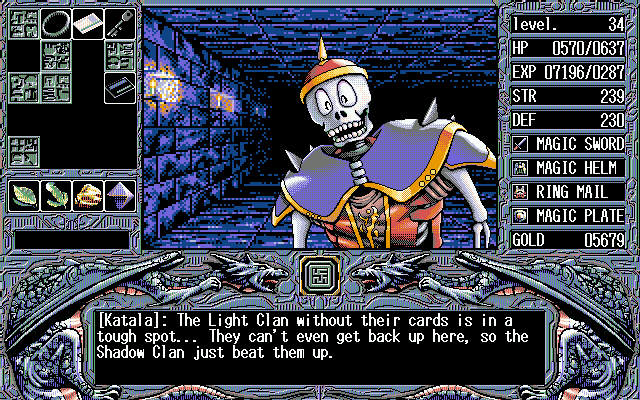
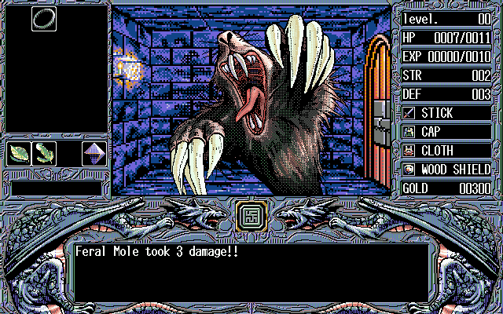
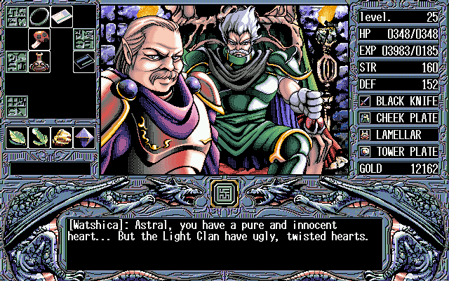
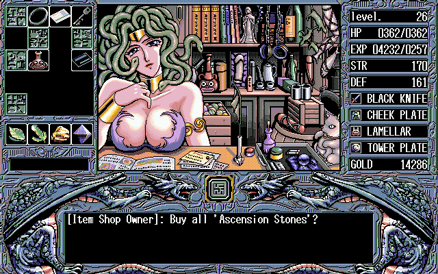

# Words Worth — English translation (PC-98, elf, 1993)

A complete English translation of *Words Worth*, elf's first-person dungeon RPG for the
NEC PC-9801, released 1993-07-22. Dialogue, battle messages, shops, item and equipment names,
the save/load menu and the title screen — 95 script files, 22 010 text forms, nothing left in
Japanese.

The PC-98 original has never been playable in English before. What exists is a 2005 fan patch
for the 1999 Windows remake — a different game in practice, with redrawn characters, reworked
gameplay and polygon dungeons — and that patch is itself partial.

| | |
|---|---|
| **Download** | [`dist/words-worth-en-v1-1.zip`](dist/words-worth-en-v1-1.zip) — one xdelta patch and a readme |
| Applies to | `Words Worth.hdi` — 20 955 136 bytes, CRC32 `8AE7E6F1`, MD5 `6b3855cece879cbba2ae9bded06deef1` (the Neo Kobe copy) |
| Produces | CRC32 `646EA627`, SHA-1 `bc2b15740785e609056d44695d8f2df64d99679c`, with all five save slots empty |
| Emulator | Neko Project II kai (np2kai), standalone or the libretro core |

Also on [GBAtemp](https://gbatemp.net/download/pc-98-words-worth-english-patch.40017/).

**Content warning.** Words Worth is an adult game: explicit sex scenes, some of them
non-consensual, and the attitudes that came with early-90s eroge. Everything is translated
plainly — nothing is censored or softened. 18+.

> **v1.0 could crash to the DOS prompt and is superseded.** Ten scripts had outgrown the
> engine's script buffer; the second Silvanna scene on floor 2 killed the game reliably.
> Fixed in v1.1 by splitting each oversized script into a parent plus a companion file —
> the way the game already does it for its own rooms — with no wording changed.
> v1.1 also corrects 45 battle lines that named the attacker where the engine prints the
> target, re-wraps 111 lines that broke mid-word, and carries a 367-fix proofreading pass.






---

## What is in this repository, and what is not

This repository holds **the patch and the tools that made it**. It deliberately does not hold
the game, or the game's text:

| not here | why |
|---|---|
| the disk image | it is the game |
| the scripts, translated or original (`*.rkt`, `*.mes`) | the full script is the copyrighted work; the scene distributes patches, not scripts |
| `tools/juice` | someone else's code, published with **no licence at all** — see below |

`tools/export_public.py` in the working tree is what builds this repository: it computes the
file set from the import graph rather than from a hand-written list, and then refuses by file
extension anything that looks like game data. A list written by hand goes stale silently; a
computed one does not.

## What this project actually was

Before anything else, this was a research question: can a **local** model and a **cloud**
model, working as a pair, carry a job like this all the way to something shippable? Not a
demo — a finished patch that survives being played by a stranger.

The division of labour turned out to matter more than either model. The local one
(Qwen3.8-27B, on one machine, nothing sent anywhere) translated: it proposes a batch of
lines, and that is all it ever does. The cloud one built the machinery around it — the
decompiler harness, the gates, the layout simulator, the emulator rig — and, more usefully,
kept asking what the gates were *not* catching. Every defect a human player found became a
new automated check, so that class could not come back silently.

That is the finding, and it flatters neither model alone: neither could have finished this.
The local one cannot judge its own output. The cloud one cannot be handed 22 010 lines of
someone else's copyrighted text. Paired, with code as the referee between them, it works.

## The translation method

A local language model translated the script. It was never in charge of anything.

The model only ever proposes a translation of a batch of lines. **Every accept and reject is
made by code** (`tools/gates.py`):

| gate | what it refuses |
|---|---|
| count | a batch that came back with a different number of lines than went in |
| charset | anything outside the game's own character set |
| markers | a line where the runtime name insertions `{0}`, `{1}` changed, moved or vanished |
| glossary | a proper noun spelled against `glossary.json` |
| width | a line that cannot fit the message window |
| **structure** | a recompiled script whose **instruction skeleton** differs from the Japanese original |

A batch that fails a gate is retried, then cut in half and retried. Whatever still fails keeps
its Japanese rather than shipping an invention — and `tools/finish_ja.py` then asks the whole
game, not a batch, what is still Japanese, because a per-batch gate cannot see a leftover.

**Layout is simulated, not eyeballed.** `tools/render.py` models elf's compiler and the
engine's 56-column message window and reproduces what each line will look like on screen,
character for character; `tools/column.py` tracks which column a line actually starts printing
at, which is not zero whenever the engine has just printed a name or a direction. That is how
898 broken words and 605 badly wrapped lines were found by counting instead of by playing.
The simulation is checked against real captured emulator frames (`tools/screenqa.py` reads the
text back off the pixels), because a model of the engine that nobody checks is just a belief.

**The build is verified by running it.** `tools/acceptance.sh` boots the patched image, walks
every split floor, replays the scene that used to crash, and visits the shops — judging life
or death by the **screen**, because a game that has exited to DOS leaves its memory intact and
will keep reporting the scene as resident. When a scene does die, the same run repeats it on
the untouched Japanese image: a room that dies there too is unreachable by teleport, not a
defect of ours. Compiling is necessary and nowhere near sufficient — a change that merely
*added* an instruction once passed every static gate and killed the game on scene load.

**One check needs the Japanese original, and no per-batch gate can do it.** `tools/audit.py`
runs the whole gate battery over the finished script rather than over a batch, because after
translation the text is edited four more times by four more tools. That is what caught the
45 reversed battle lines — the instruction skeleton was identical, the width was fine, every
static gate was green, and the sentence said the opposite of what happened.

Numbers, defects found and the reasoning behind each decision are in the working log, not here.

## Proofreading

**[→ PROOFREADING.md](PROOFREADING.md)** — the whole guide, start there.

Short version: you need Python and a text editor, nothing else. Clone this repository, unzip
the `text/` folder you were sent into it, edit the `en` fields, and run:

```sh
python3 tools/check.py
```

It writes nothing. It reads your edits and tells you, in plain English, what the game would
refuse and why — a lost `{0}` marker, a character the game's font cannot draw, a line that
will not fit the 56-column window. Fix, re-run, send `text/` back.

⚠️ `text/` is deliberately absent from this repository and listed in `.gitignore`: it is the
game's full script, and the reason this scene distributes patches rather than scripts.

## Requirements

| | |
|---|---|
| Python | 3.9+ |
| Racket | plus `ansi-color`, `bitsyntax`, `parsack` — `make juice` installs them |
| `mtools` | reads and writes the FAT partition inside the disk image |
| `xdelta3` | builds and applies the per-file deltas |
| emulator | `np2kai` libretro core + [`libretro.py`](https://pypi.org/project/libretro.py/) in a venv, for the verification harness |
| a model | any OpenAI-compatible endpoint; set `WW_LLM_URL` and `WW_LLM_MODEL` |

```sh
make juice      # clone the AI5 (de)compiler at its pinned commit
make verify     # layout, names, sizes, patch integrity, image build
```

To rebuild anything you need your own copy of the game at `game/WordsWorth.hdi`. This
repository will not help you find one.

## Credits

- Translation pipeline, hacking, tooling: **kukfirst**
- [**juice**](https://github.com/tomyun/juice), the (de)compiler for elf's AI5 `.MES`
  bytecode, by **Kyungdahm Yun** (tomyun). Not included here: upstream publishes no licence,
  so there is no permission to redistribute it. `tools/get_juice.sh` clones it at a pinned
  commit. Without it none of this exists.
- **Neko Project II kai** (np2kai) by **AZO234**, used to build and to verify.

The code in this repository is MIT-licensed (see `LICENSE`). That covers the tools only —
not the game, and not juice.
