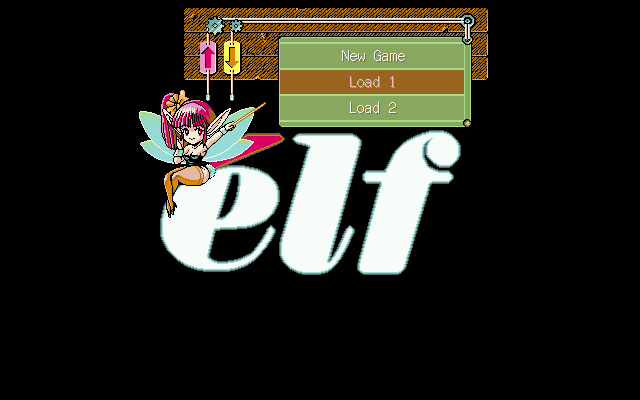
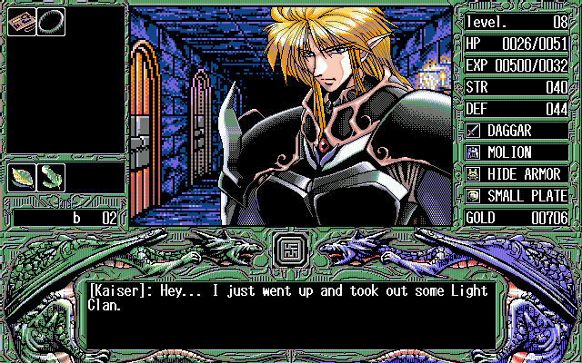

# Words Worth — English translation (PC-98, elf, 1993)

A complete English translation of *Words Worth*, elf's first-person dungeon RPG for the
NEC PC-9801, released 1993-07-22. Dialogue, battle messages, shops, item and equipment names,
the save/load menu and the title screen — 95 script files, 22 010 text forms, nothing left in
Japanese.

The PC-98 original has never been playable in English before. What exists is a 2005 fan patch
for the 1999 Windows remake — a different game in practice, with redrawn characters, reworked
gameplay and polygon dungeons — and that patch is itself partial.

| | |
|---|---|
| **Download** | [`dist/words-worth-en-v1-0.zip`](dist/words-worth-en-v1-0.zip) — one xdelta patch and a readme |
| Applies to | `Words Worth.hdi` — 20 955 136 bytes, CRC32 `AE44FCDD`, SHA-1 `d6133fdd5b33a1656e3d24f4026f4be58ee7c630` |
| Produces | CRC32 `A3F44833`, SHA-1 `29571812ac8e58e64ffffdab4573d91ce507033f`, with all five save slots empty |
| Emulator | Neko Project II kai (np2kai), standalone or the libretro core |

Also on [GBAtemp](https://gbatemp.net/download/pc-98-words-worth-english-patch.40017/).

**Content warning.** Words Worth is an adult game: explicit sex scenes, some of them
non-consensual, and the attitudes that came with early-90s eroge. Everything is translated
plainly — nothing is censored or softened. 18+.





---

## What is in this repository, and what is not

This repository holds **the patch and the tools that made it**. It deliberately does not hold
the game, or the game's text:

| not here | why |
|---|---|
| the disk image | it is the game |
| the scripts, translated or original (`*.rkt`, `*.mes`) | the full script is the copyrighted work; the scene distributes patches, not scripts |
| `tools/juice` | someone else's code, published with **no licence at all** — see below |

`tools/export_public.py` in the working tree is what builds this repository: it computes the
file set from the import graph rather than from a hand-written list, and then refuses by file
extension anything that looks like game data. A list written by hand goes stale silently; a
computed one does not.

## The translation method

A local language model translated the script. It was never in charge of anything.

The model only ever proposes a translation of a batch of lines. **Every accept and reject is
made by code** (`tools/gates.py`):

| gate | what it refuses |
|---|---|
| count | a batch that came back with a different number of lines than went in |
| charset | anything outside the game's own character set |
| markers | a line where the runtime name insertions `{0}`, `{1}` changed, moved or vanished |
| glossary | a proper noun spelled against `glossary.json` |
| width | a line that cannot fit the message window |
| **structure** | a recompiled script whose **instruction skeleton** differs from the Japanese original |

A batch that fails a gate is retried, then cut in half and retried. Whatever still fails keeps
its Japanese rather than shipping an invention — and `tools/finish_ja.py` then asks the whole
game, not a batch, what is still Japanese, because a per-batch gate cannot see a leftover.

**Layout is simulated, not eyeballed.** `tools/render.py` models elf's compiler and the
engine's 56-column message window and reproduces what each line will look like on screen,
character for character; `tools/column.py` tracks which column a line actually starts printing
at, which is not zero whenever the engine has just printed a name or a direction. That is how
898 broken words and 605 badly wrapped lines were found by counting instead of by playing.
The simulation is checked against real captured emulator frames (`tools/screenqa.py` reads the
text back off the pixels), because a model of the engine that nobody checks is just a belief.

**The build is verified by running it.** `emu/battle_probe.py` boots the patched image in the
emulator, walks until a random encounter happens and reports whether the game survived the
fight. Compiling is necessary and nowhere near sufficient: a change that merely *added* an
instruction once passed every static gate and killed the game on scene load.

Numbers, defects found and the reasoning behind each decision are in the working log, not here.

## Proofreading

If you were sent a copy of this tree as an archive, it contains a `text/` directory that is
**not** in the public repository. That is the whole English script, flattened for reading:
one entry per line, with the line as it will actually land in the game's 56-column window.

```json
{
 "id": "FLOOR02.MES#41",
 "en": "[{0}]: My, my head's spinning... Someone cast a\nspell on me.",
 "was": "fd514727",
 "screen": ["[xxxxxx]: My, my head's spinning... Someone cast a",
            "spell on me."]
}
```

`screen` is produced by a model of elf's compiler and of the engine's message window, checked
against real captured frames — so a broken line break is visible without running the game.
`xxxxxx` stands for the hero's name, which the engine substitutes at runtime.

**To proofread:** edit the `en` fields. Leave `id` and `was` alone — `was` is a fingerprint of
the line you started from, and it is what proves you edited the line you meant to. Then:

```sh
python3 tools/import_text.py            # show what changed, and what was refused
python3 tools/import_text.py --apply    # write it back and recompile
python3 tools/export_text.py            # regenerate text/ from the current scripts
```

Every changed line is checked before anything is written: the `{0}` markers must survive
unchanged, the characters must exist in the game's own character set, the line must still fit
the window without breaking a word, the fingerprint must match, and the recompiled script must
stay under the engine's buffer. **If any line fails, nothing is written at all** — half of an
accepted proofread is worse than none, because afterwards you cannot tell what landed.

⚠️ `text/` is deliberately absent from the repository and listed in `.gitignore`: it is the
game's text, and the reason this scene distributes patches rather than scripts. Please keep it
out of public places.

## Requirements

| | |
|---|---|
| Python | 3.9+ |
| Racket | plus `ansi-color`, `bitsyntax`, `parsack` — `make juice` installs them |
| `mtools` | reads and writes the FAT partition inside the disk image |
| `xdelta3` | builds and applies the per-file deltas |
| emulator | `np2kai` libretro core + [`libretro.py`](https://pypi.org/project/libretro.py/) in a venv, for the verification harness |
| a model | any OpenAI-compatible endpoint; set `WW_LLM_URL` and `WW_LLM_MODEL` |

```sh
make juice      # clone the AI5 (de)compiler at its pinned commit
make verify     # layout, names, sizes, patch integrity, image build
```

To rebuild anything you need your own copy of the game at `game/WordsWorth.hdi`. This
repository will not help you find one.

## Credits

- Translation pipeline, hacking, tooling: **kukfirst**
- [**juice**](https://github.com/tomyun/juice), the (de)compiler for elf's AI5 `.MES`
  bytecode, by **Kyungdahm Yun** (tomyun). Not included here: upstream publishes no licence,
  so there is no permission to redistribute it. `tools/get_juice.sh` clones it at a pinned
  commit. Without it none of this exists.
- **Neko Project II kai** (np2kai) by **AZO234**, used to build and to verify.

The code in this repository is MIT-licensed (see `LICENSE`). That covers the tools only —
not the game, and not juice.
